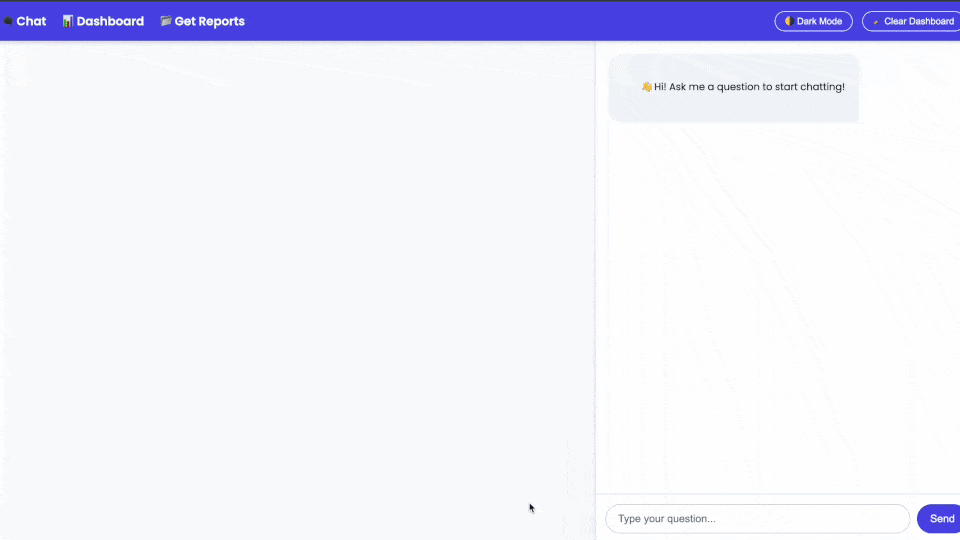

# Dynamic Query Visualizer

A multi-agent AI system that converts natural language questions into SQL queries, executes them against a PostgreSQL database, and generates interactive visualizations with AI-powered insights.




## Overview

Dynamic Query Visualizer uses an agentic architecture with LangGraph to orchestrate multiple specialized agents:
- **SQL Agent**: Converts natural language to PostgreSQL queries with error correction
- **Visualization Agent**: Generates Python code for interactive charts using Plotly
- **Report Agent**: Creates AI-driven summaries and insights

The system leverages GPT-4o for intelligent query generation and correction, ensuring robust SQL execution even when initial queries fail.

## Project Structure

```
Dynamic-Query-Visualization/
├── agent/
│   ├── sql_react_agent.py           # SQL generation & correction agent
│   ├── initiate_llm.py              # LLM initialization (GPT-4o)
│   └── final_supervisor_agent_report.py  # Orchestrator agent
├── app.py                           # Flask web application
├── static/
│   ├── images/                      # Generated visualizations
│   └── css/
│       ├── chat_style.css
│       └── dashboard.css
├── templates/
│   ├── chat.html                    # Chat interface
│   ├── dashboard.html               # Results dashboard
│   └── reports.html                 # Reports view
├── requirements.txt
└── README.md
```

## Key Technologies

- **LangGraph**: Agentic workflow orchestration with state management
- **LangChain**: LLM integration and database tooling
- **GPT-4o**: Natural language understanding & SQL/Python code generation
- **PostgreSQL**: Database backend
- **Flask**: Web framework
- **Plotly**: Interactive visualizations
- **Pydantic**: Structured output schemas

## Core Principles

### 1. **Agentic Architecture**
The system uses a multi-agent orchestrator pattern:
- Each agent has a specific responsibility (SQL, visualization, reporting)
- Agents communicate via shared state (messages, query results, dataframes)
- The supervisor agent routes tasks and aggregates results

### 2. **LangGraph State Management**
- **AgentState**: Central state object containing message history and execution context
- **add_messages**: Reducer that accumulates messages (prevents token loss)
- **Command-based Routing**: Nodes conditionally route to other nodes or END based on execution results

### 3. **Structured LLM Output**
- Uses Pydantic models (`SQLOutput`) with `.with_structured_output()`
- Ensures LLM responses conform to expected schema (no parsing errors)
- Enables type-safe downstream processing

### 4. **Error Recovery**
- **SQL Node**: Generates initial query; if execution fails, passes error to correction node
- **Correction Loop**: LLM analyzes error message and database schema, produces corrected SQL
- **Graceful Degradation**: Reports execution errors to user if all retries fail

### 5. **Message-Based Workflow**
- All agent outputs wrapped in `ToolMessage` with JSON content
- Maintains full audit trail of generation → execution → correction → visualization
- Enables debugging and result tracking

## Installation

### Prerequisites
- Python 3.10+
- A PostgreSQL database (Supabase / Neon supported out of the box)
- OpenAI API key

### Setup

1. **Clone the repository**
   ```bash
   cd /Users/mehulmathur/AI\ Projects/Dynamic\ Query\ Visualizer/Dynamic-Query-Visualization
   ```

2. **Create virtual environment**
   ```bash
   python3 -m venv venv
   source venv/bin/activate
   ```

3. **Install dependencies**
   ```bash
   pip install -r requirements.txt
   ```

4. **Configure environment variables (optional)**
   Create a `.env` file in the project root if you want defaults:
   ```env
   # Used to sign the Flask session cookie
   FLASK_SECRET_KEY=dev-secret-change-in-production

   # Optional: restrict which hosts users can connect to via db_url
   # ALLOWED_DB_HOST_SUFFIXES=supabase.co,neon.tech
   ```

## Running the Application

### Web Interface
```bash
python app.py
```
Visit `http://localhost:5000` in your browser. Enter natural language questions and view:
- Generated SQL query
- Query results as interactive table
- AI-generated visualization
- Insights summary

On first load, the UI will prompt for:
- `db_url`: your PostgreSQL connection string (e.g. Supabase/Neon)
- `db_password` (optional): if your URL has no password
- `schema_name` (optional): defaults to the database default schema
- OpenAI API key

### Supabase / Neon connection strings

The app accepts standard PostgreSQL connection URLs that SQLAlchemy can use.

**Supabase (direct connection)**
```text
postgresql://postgres@db.<project-ref>.supabase.co:5432/postgres?sslmode=require
```

**Neon (direct connection)**
```text
postgresql://<user>@<endpoint>.neon.tech/<db>?sslmode=require
```

**Password handling (important)**
- Recommended: leave the password out of `db_url` and put it into the UI’s `db_password` field.
- If you embed the password in the URL, it must be URL-encoded (e.g. `#` must be `%23`).

**Schema handling**
- If your tables live in a non-`public` schema (e.g. `analytical_schema`), set `schema_name=analytical_schema` in the UI.

### Command-Line Testing
```bash
python3 -c "
from agent.sql_react_agent import graph
from langchain_core.messages import HumanMessage

state = {'messages': [HumanMessage(content='What is the average salary by department?')]}
result = graph.invoke(state)

for msg in result['messages']:
    msg.pretty_print()
"
```

## Agent Workflows

### SQL Agent (`sql_react_agent.py`)
```
gen_sql_node
    ↓ (generates SQLOutput)
exec_sql_node
    ↓ (executes query, returns result)
check_node
    ├→ if error: corrects SQL, loops back to exec_sql
    └→ if success: returns END
```

**Key Features:**
- Structured LLM output with `.with_structured_output(SQLOutput)`
- Dynamic schema awareness (reads all table DDL)
- Error-aware correction using GPT-4o
- No prompt templates (values pre-filled for clarity)

**SQLOutput Schema:**
```python
class SQLOutput(BaseModel):
    sql_query: str = Field(description="The raw SQL query that answers the user's question")
```

### Visualization Agent
Consumes SQL results and generates Plotly code:
- Automatically selects chart type (bar, line, scatter, etc.)
- Handles numeric/categorical/time-series data
- Outputs `fig` object for rendering

### Report Agent
Aggregates results and generates insights:
- Summarizes query intent and results
- Identifies trends and outliers
- Provides business context

## Example Usage

**Question:** "What is the average salary of employees each year for the past 5 years?"

**Flow:**
1. SQL Agent generates: 
   ```sql
   SELECT EXTRACT(YEAR FROM hire_date) AS year, AVG(salary) 
   FROM employees 
   WHERE hire_date > CURRENT_DATE - INTERVAL '5 years' 
   GROUP BY year 
   ORDER BY year
   ```
2. Executes against PostgreSQL
3. Visualization Agent generates Plotly line chart code
4. Report Agent writes summary: "Salary trends show X% growth over 5 years..."
5. Flask renders results in web UI

## Configuration

### LLM Model
Edit `agent/initiate_llm.py`:
```python
gpt_llm = ChatOpenAI(model="gpt-4o")  # or "gpt-4-turbo", "gpt-3.5-turbo"
```

### Database Schema
The system auto-detects tables. To limit to specific schema:
```python
db = SQLDatabase(engine, schema="analytical_schema")
```

### Error Recovery Retries
Modify retry logic in `check_node()` to adjust error correction attempts.

## Troubleshooting

| Issue | Solution |
|-------|----------|
| "Database host is not allowed" | Use a Supabase/Neon host (or set `ALLOWED_DB_HOST_SUFFIXES` in `.env` / container env). |
| "Could not connect to the provided database URL" | Ensure the URL/user/password are correct; add `?sslmode=require`; for special chars in passwords prefer `db_password` or URL-encode. |
| "Invalid API Key" | Ensure `OPENAI_API_KEY` is set in `.env` |
| SQL execution fails on first attempt | Check agent logs; correction node will retry automatically |
| Visualization not generating | Ensure Plotly/kaleido installed: `pip install plotly kaleido` |

## Performance Notes

- First query: ~3-5 seconds (LLM inference + SQL execution)
- Cached schema info reduces subsequent queries to ~2-3 seconds
- Large result sets (>10k rows) may slow visualization generation

## Future Enhancements

- Multi-turn conversational context
- Query optimization suggestions
- Data privacy redaction filters
- Support for Snowflake, BigQuery backends
- Batch query scheduling
- Query result caching

## License

MIT

## Contact

Mehul Mathur
